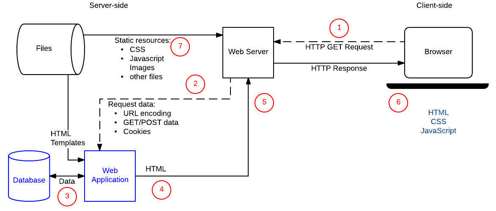

클라이언트-서버 개요
--------------------

이 문서는 저작자 동의없이 KAIST 대학정보화사업팀을 위하여 [Introduction to the server side](https://developer.mozilla.org/en-US/docs/Learn/Server-side/First_steps/Introduction)를 번역 편집하여 작성한 것입니다.

이제 서버사이드 프로그래밍의 목적과 잠재적 이점을 알았습니다. 서버가 브라우저에서 "동적 요청"을 받았을 때 어떤 일이 발생하는지 자세히 살펴 보겠습니다. 대부분 웹 사이트의 서버사이드 코드는 요청 및 응답을 유사한 방식으로 처리하므로 대부분의 코드를 작성할 때 수행해야 할 작업을 이해하는 데 도움이 될 것입니다.

> 선수지식: 기본적인 컴퓨터 활용 능력과 웹 서버에 대한 기본적인 이해가 필요합니다.
>
> 목표: 동적 웹 사이트에서 클라이언트-서버 상호 작용, 특히 서버사이드 코드로 수행해야 하는 작업을 이해합니다.

실제로 코드를 다루지 않습니다. 코드 작성에 사용할 웹 프레임워크를 아직 선택하지 않았기 때문입니다! 실제 코드 작성은 아직 중요하지 않습니다. 왜냐하면 사용자가 선택한 프로그래밍 언어 또는 웹 프레임워크와 관계없이 서버사이드 코드는 주어진 요구사항을 구현하여야 하기 때문입니다.

### 웹 서버와 HTTP (기초)

웹 브라우저는 HTTP(<b>H</b>yper<b>T</b>ext <b>T</b>ransfer <b>P</b>rotocol)를 사용하여 [웹 서버](whatisWebServer.md)와 통신합니다. 웹 페이지의 링크를 클릭하거나 양식을 제출하거나 검색을 실행하면 브라우저는 서버에 <i>HTTP 요청</i>을 전송합니다.

요청에는 아래 사항들이 있습니다.

-	대상 서버 및 리소스를 식별하는 URL (예: HTML 파일, 서버의 특정 데이터 요소 또는 실행할 도구).
-	요청하는 작업(예 : 파일 가져오기 또는 일부 데이터 저장하거나 업데이트)을 정의하는 메서드. 아래에 다양한 메소드/동사와 연결된 연산을 열거합니다.
	-	<code>GET</code>: 특정 리소스 (예 : 제품 또는 제품 목록에 대한 정보가 들어있는 HTML 파일)를 가져옵니다.
	-	<code>POST</code>: 새 리소스를 만듭니다(예 : 새 문서를 Wiki에 추가하고 새 연락처를 데이터베이스에 추가).
	-	<code>HEAD</code>: <code>GET</code>처럼 특정 리소스에 대한 본문을 가져오지 않고 메타 데이터 정보를 가져옵니다. 예를 들어 <code>HEAD</code> 요청을 보내 리소스가 마지막으로 업데이트 된 시간을 확인한 다음 리소스가 변경된 경우에만 (더 "비싼") <code>GET</code> 요청을 사용하여 리소스를 다운로드받을 수도 있습니다.
	-	<code>PUT</code>: 기존 자원을 갱신하거나 없다면 자원을 새로 생성합니다.
	-	<code>DELETE</code>: 지정된 리소스를 삭제합니다.
	-	<code>TRACE</code>, <code>OPTIONS</code>, <code>CONNECT</code>, <code>PATCH</code>: 이 동사는 흔히 사용되지 않고 고급 작업을 위한 것이므로 여기서는 설명을 생략합니다.
-	요청과 함께 추가 정보(예 : HTML 양식 데이터)를 인코딩할 수 있습니다. 정보는 다음과 같이 인코딩 될 수 있습니다.
	-	URL 매개 변수: <code>GET</code> 요청은 이름/값 쌍을 URL끝에 추가하여 서버로 보내는 데이터를 인코딩합니다 (예 : <code>http://mysite.com?<b>name=Fred&age=11</b></code>). 물음표(<code>?</code>)는 URL 매개 변수와 나머지 URL을 구분하고 , 등호(<code>=</code>)는 이름을 관련 값과 분리하고, 앰퍼샌드(<code>&</code>)는 이름/값 쌍을 분리합니다. URL 매개 변수는 사용자가 변경하여 다시 제출할 수 있으므로 본질적으로 "안전하지 않습니다". 그러므로 서버의 데이터를 업데이트하는 요청에는 URL 매개 변수/<code>GET</code> 요청을 사용하지 않습니다.
	-	<code>POST</code> 데이터. <code>POST</code> 요청은 요청 본문 내에 인코딩된 데이터 즉 새로운 리소스를 추가합니다.
	-	클라이언트사이드 쿠키. 쿠키는 로그인 상태와 자원에 대한 접근 권한를 정하는 데 서버가 사용할 수있는 키를 포함하여 클라이언트에 대한 세션 데이터를 갖고 있습니다.

웹 서버는 클라이언트 요청 메시지를 기다리고, 요청 메시지가 도착하면 이를 처리하여 웹 브라우저에 HTTP 응답 메시지로 응답합니다. 응답은 요청의 성공 여부를 나타내는 [HTTP Response status code](https://developer.mozilla.org/en-US/docs/Web/HTTP/Status)를 포함하고 있습니다 (예: 성공의 경우 "<code>200 OK</code>", 자원을 찾을 수없는 경우 "<code>404 Not Found</code>", 사용자가 자원을 볼 권한이 없는 경우 "<code>403 Forbidden</code>"). <code>GET</code> 요청에 대한 성공적인 응답의 본문은 요청된 리소스를 포함합니다.

HTML 페이지가 반환되면 웹 페이지가 이를 렌더링합니다. 처리 과정에서 브라우저는 다른 리소스 (예 : HTML 페이지는 일반적으로 JavaScript 및 CSS 페이지를 참조)에 대한 링크를 발견하기도 하며 이때 이 파일을 다운로드하기 위해 별도의 HTTP 요청을 보냅니다.

정적 및 (다음에 설명할) 동적 웹 사이트는 정확히 동일한 통신 프로토콜/패턴을 사용합니다.

#### GET 요청/응답 예

링크를 클릭하거나 사이트(예 : 검색 엔진 홈페이지)에서 검색하여 간단한 <code>GET</code> 요청을 할 수 있습니다. 예를 들어 "클라이언트 서버 개요"라는 용어에 대해 MDN에서 검색을 수행할 때 전송되는 HTTP 요청은 아래에 표시된 텍스트와 비슷할 것입니다 (메시지 부분이 브라우저/설정에 따라 다르므로 동일하지 않습니다 ).

> **note** : "web standard"([RFC7230](http://www.rfc-editor.org/rfc/rfc7230.txt))은 HTTP 메시지의 형식을 정의합니다. 이 수준의 세부 사항을 알 필요는 없지만 적어도 이제는이 모든 것이 어디에서 왔는 지를 알 수 있습니다!

##### 요청 (The request)

요청의 각 행에는 이에 대한 정보가 들어 있습니다. 첫 번째 부분은 헤더라고 하며 HTML 헤드가 이 본문에있는 실제 내용이 아닌 HTML 문서에 대한 유용한 정보를 지닌 것처럼 요청에 대한 유용한 정보를 갖고 있습니다.

<pre><code>GET https://developer.mozilla.org/en-US/search?q=client+server+overview&topic=apps&topic=html&topic=css&topic=js&topic=api&topic=webdev
HTTP/1.1 Host: developer.mozilla.org
Connection: keep-alive
Pragma: no-cache
Cache-Control: no-cache
Upgrade-Insecure-Requests: 1
User-Agent: Mozilla/5.0 (Windows NT 10.0; WOW64) AppleWebKit/537.36 (KHTML, like Gecko) Chrome/52.0.2743.116 Safari/537.36
Accept: text/html,application/xhtml+xml,application/xml;q=0.9,image/webp,\*/\*;q=0.8 Referer: https://developer.mozilla.org/en-US/
Accept-Encoding: gzip, deflate, sdch, br
Accept-Charset: ISO-8859-1,UTF-8;q=0.7,\*;q=0.7
Accept-Language: en-US,en;q=0.8,es;q=0.6
Cookie: sessionid=6ynxs23n521lu21b1t136rhbv7ezngie; csrftoken=zIPUJsAZv6pcgCBJSCj1zU6pQZbfMUAT; dwf_section_edit=False; dwf_sg_task_completion=False; \_gat=1; \_ga=GA1.2.1688886003.1471911953; ffo=true
</code></pre>

첫 번째 줄과 두 번째 줄에 위에서 언급한 대부분의 정보가 있습니다.

-	요청 유형 (<code>GET</code>).
-	대상 리소스 URL (<code>/en-US/search</code>).
-	URL 매개변수 (<code>q=client%2Bserver%2Boverview&topic=apps&topic=html&topic=css&topic=js&topic=api&topic=webdev</code>).
-	대상/호스트 웹 사이트 (<code>developer.mozilla.org</code>).
-	첫번째 줄 끝 부분에 특정 프로토콜 버전을 식별하는 문자열 또한 있습니다. (<code>HTTP/1.1</code>).

마지막 줄에는 클라이언트사이드 쿠키에 대한 정보가 들어 있습니다. 이 경우 쿠키에는 세션 관리를 위한 ID를 포함하고 있습니다 (<code>Cookie: sessionid = 6ynxs23n521lu21b1t136rhbv7ezngie ...</code>).

나머지 줄에는 사용하는 브라우저와 처리 할 수 있는 응답에 대한 정보를 포함합니다. 예를 들면 다음과 같은 내용이 있습니다.

-	요청에 사용한 브라우저(<code>User-Agent</code>)는 Mozilla Firefox (<code>Mozilla / 5.0</code>)입니다.
-	정보 압축에 gzip을 사용(<code>Accept-Encoding: gzip</code>)할 수 있습니다.
-	지정된 문자 코드(<code>Accept-Charset : ISO-8859-1, UTF-8, q = 0.7, \*; q = 0.7</code>)와 언어(<code>Accept-Language : de, en; q = 0.7, en-US; q = 0.3</code>)를 처리할 수 있습니다.
-	<code>Referer</code> 줄은 이 리소스 링크를 포함하고 있는 웹 페이지의 주소를 나타냅니다. (예 : 요청의 출처, <code>https://developer.mozilla.org/en-US/</code>\)

경우에는 비어 있지만 HTTP 요청에는 본문이 있을 수도 있습니다.

##### 응답

위의 요청에 대한 응답의 첫 번째 부분은 아래와 같습니다. 헤더에는 다음과 같은 정보가 들어 있습니다.

-	첫 번째 줄에는 응답 코드 <code>200 OK</code>를 포함하여 요청이 성공했다고 알립니다.
-	응답은 <code>text/html</code> 형식임을 알 수 있습니다 (<code>Content-Type</code>).
-	UTF-8 문자 집합을 사용한다는 것도 알 수 있습니다 (<code>Content-Type : text / html; charset = utf-8</code>).
-	head의 길이를 알려줍니다 (<code>Content-Length : 41823</code>).

메시지 뒤에는 요청에 의해 반환된 실제 HTML을 포함하는 본문 내용이 표시됩니다.

<pre><code>
HTTP/1.1 200 OK
Server: Apache
X-Backend-Server: developer1.webapp.scl3.mozilla.com
Vary: Accept,Cookie, Accept-Encoding
Content-Type: text/html;
charset=utf-8
Date: Wed, 07 Sep 2016 00:11:31 GMT
Keep-Alive: timeout=5, max=999
Connection: Keep-Alive
X-Frame-Options: DENY
Allow: GET
X-Cache-Info: caching
Content-Length: 41823
</code></pre>

```html
<!DOCTYPE html>
<html lang="en-US" dir="ltr" class="redesign no-js"  data-ffo-opensanslight=false data-ffo-opensans=false >
<head prefix="og: http://ogp.me/ns#">
	<meta charset="utf-8">
	<meta http-equiv="X-UA-Compatible" content="IE=Edge">
	<script>(function(d) { d.className = d.className.replace(/\bno-js/, ''); })(document.documentElement);
	</script>
	...
```

응답 헤더의 나머지 부분에는 응답(예: 생성 시점), 서버 및 브라우저가 페이지를 처리하는 방법에 대한 정보(예 : <code>X-Frame-Options : DENY</code> 행은 브라우저가 페이지에 다른 사이트의 <code>[\<iframe\>](https://developer.mozilla.org/en-US/docs/Web/HTML/Element/iframe)</code>의 삽입을 허용하지 않도록 지시)가 있습니다.

#### POST 요청/응답 예

HTTP <code>POST</code>는 서버에 저장할 정보를 포함한 양식을 제출할 때 만들어집니다.

##### 요청

아래 텍스트는 사용자가 이 사이트에서 새 프로필 세부 정보를 제출할 때 만들어진 HTTP 요청을 보여 줍니다. 요청의 형식은 이전에 표시된 <code>GET</code> 요청 예제와 유사하지만 첫 번째 행의 <code>POST</code> 요청으로 식별합니다.

<pre><code>
HTTP/1.1 200 OK
POST https://developer.mozilla.org/en-US/profiles/hamishwillee/edit HTTP/1.1
Host: developer.mozilla.org
Connection: keep-alive
Content-Length: 432
Pragma: no-cache
Cache-Control: no-cache
Origin: https://developer.mozilla.org
Upgrade-Insecure-Requests: 1
User-Agent: Mozilla/5.0 (Windows NT 10.0; WOW64) AppleWebKit/537.36 (KHTML, like Gecko) Chrome/52.0.2743.116 Safari/537.36
Content-Type: application/x-www-form-urlencoded
Accept: text/html,application/xhtml+xml,application/xml;q=0.9,image/webp,\*/\*;q=0.8
Referer: https://developer.mozilla.org/en-US/profiles/hamishwillee/edit
Accept-Encoding: gzip, deflate, br
Accept-Language: en-US,en;q=0.8,es;q=0.6
Cookie: sessionid=6ynxs23n521lu21b1t136rhbv7ezngie; \_gat=1; csrftoken=zIPUJsAZv6pcgCBJSCj1zU6pQZbfMUAT; dwf_section_edit=False; dwf_sg_task_completion=False; \_ga=GA1.2.1688886003.1471911953; ffo=true
csrfmiddlewaretoken=zIPUJsAZv6pcgCBJSCj1zU6pQZbfMUAT&user-username=hamishwillee&user-fullname=Hamish+Willee&user-title=&user-organization=&user-location=Australia&user-locale=en-US&user-timezone=Australia%2FMelbourne&user-irc_nickname=&user-interests=&user-expertise=&user-twitter_url=&user-stackoverflow_url=&user-linkedin_url=&user-mozillians_url=&user-facebook_url=
</code></pre>

주요 차이점은 URL에 매개변수가 없는 것입니다. 보시다시피 양식의 정보는 요청 본문에 인코딩됩니다 (예: <code>&user-fullname=Hamish+Willee</code>을 사용하여 새 사용자 성명를 설정합니다).

##### 응답

요청에 대한 응답은 아래와 같습니다. 상태 코드 "302 Found"는 브라우저에게 post 요청이 성공했음과 <code>Location</code> 필드에 지정된 페이지를 로드하기 위해 두 번째 HTTP 요청을 실행해야 함을 알려 줍니다. 그렇지 않은 경우 정보는 <code>GET</code> 요청에 대한 응답 정보와 유사합니다.

<pre><code>
HTTP/1.1 302 FOUND
Server: Apache
X-Backend-Server: developer3.webapp.scl3.mozilla.com
Vary: Cookie
Vary: Accept-Encoding
Content-Type: text/html; charset=utf-8
Date: Wed, 07 Sep 2016 00:38:13 GMT
Location: https://developer.mozilla.org/en-US/profiles/hamishwillee
Keep-Alive: timeout=5, max=1000
Connection: Keep-Alive
X-Frame-Options: DENY
X-Cache-Info: not cacheable; request wasn't a GET or HEAD
Content-Length: 0
</code></pre>

> **note** : 이 예에서 보여주는 HTTP 응답 및 요청은 [Fiddler](https://www.telerik.com/download/fiddler) 애플리케이션을 사용하여 캡처했지만 웹 스니퍼 (예 : [Websniffer](http://websniffer.cc/)) 또는 [HttpFox](https://addons.mozilla.org/en-US/firefox/addon/httpfox/)와 같은 브라우저 확장 프로그램을 사용하여 유사한 정보를 얻을 수 있습니다. 사용자 스스로 시도 할 수 있습니다. 연결된 도구를 사용하고 사이트를 탐색하고, 프로필 정보를 편집하여 다양한 요청과 응답을 확인하십시오. 대부분의 최신 브라우저에는 네트워크 요청을 모니터할 수 있는 도구(예 : Firefox의 [Network Monitor](https://developer.mozilla.org/en-US/docs/Tools/Network_Monitor) 도구)가 있습니다.

### 정적 사이트

정적 사이트는 특정 리소스가 요청될 때마다 서버에 저장된 동일한 하드 코딩된 콘텐츠를 반환하는 사이트입니다. 예를 들어 제품에 대한 페이지가 <code>/static/myproduct1.html</code>에 있는 경우, 이 동일한 페이지가 모든 사용자에게 반환됩니다. 사이트에 다른 유사한 제품을 추가하는 경우 다른 페이지 (예: <code>myproduct2.html</code>)를 추가해야 합니다. 이는 실제로 비효율적일 수 있습니다. 제품 페이지가 수천 개에 이르면 어떻겠습니까? 각 페이지의 코드(기본 페이지 템플릿, 구조체 등)를 반복하여야 하며, 예를 들어 새롭게 '관련 제품' 섹션을 추가하는 경우처럼 페이지 구조를 변경하려 할때, 모든 페이지를 개별적으로 변경해야 합니다.

> **note** : 정적 사이트는 페이지 수가 적고 모든 사용자에게 동일한 콘텐츠를 보내려고 할 때 탁월합니다. 그러나 페이지 수가 증가하면 유지 비용이 많이 듭니다.

[마지막 페이지](introServer.md)의 정적 사이트 아키텍처 다이어그램을 다시 살펴봄으로써 어떻게 작동하는지 다시 한번 살펴 보겠습니다.


사용자가 페이지를 탐색하려고 하면 브라우저는 해당 HTML 페이지의 URL을 지정하여 HTTP <code>GET</code> 요청을 보냅니다. 서버는 요청된 문서를 파일 시스템에서 검색하여, (성공을 나타내는) "<code>200 OK</code>"의 [HTTP 응답 상태 코드](https://developer.mozilla.org/en-US/docs/Web/HTTP/Status)와 문서를 포함하는 HTTP 응답을 반환합니다. 서버는 다른 상태 코드(예: 서버에 파일이 없으면 "<code>404 Not Found</code>", 파일이 있지만 다른 위치로 이동한 경우 "<code>301 Moved Permanently</code>")를 반환 할 수 있습니다.

서버가 수정 가능한 데이터를 저장하지 않으므로 정적 사이트용 서버는 오직 GET 요청만 처리합니다. 또한 HTTP 요청 데이터(예 : URL 매개변수 또는 쿠키) 기반인 응답을 변경하지 않습니다.

동적 사이트는 정적 파일(CSS, JavaScript, 정적 이미지 등)에 대한 요청을 정확히 같은 방식으로 처리하기 때문에 정적 사이트의 작동 방식에 대한 이해는 서버사이드 프로그래밍을 배울 때에도 유용합니다.

### 동적 사이트

<i>동적 사이트</i>는 특정 URL에 대해 항상 동일한 하드 코딩된 파일을 반환하지 않고 특정 요청 URL 및 데이터를 기반으로 콘텐츠를 생성하여 반환할 수 있는 사이트입니다. 제품 사이트의 예를 들면 서버는 제품 "데이터"를 개별 HTML 파일이 아닌 데이터베이스에 저장합니다. 제품에 대한 HTTP <code>GET</code> 요청을 받으면 서버는 제품 ID를 확인하고 데이터베이스에서 데이터를 가져온 다음 데이터를 HTML 템플리트에 삽입하여 응답을 위한 HTML 페이지를 구성합니다. 이것이 정적 사이트에 비하면 큰 장점입니다.

데이터베이스를 사용하면 쉽게 확장 가능하며, 수정 가능하며, 검색 가능한 방식으로 제품 정보를 효율적으로 저장할 수 있습니다.

또한, HTML 템플리트를 사용하여 HTML 구조를 변경하는 것이 매우 용이합니다. 수천 개의 정적 페이지가 아니라 하나의 템플리트에서 수행하면 되기 때문입니다.

#### 동적 요청 해부

이 섹션에서는 "동적" HTTP 요청과 응답 주기에 대한 단계별 개요를 [마지막 페이지](introServer.md)에서 보다 자세히 설명합니다. "실제 상황의 예를 보이기 위해" 코치가 다음 게임을 위해 HTML 형식으로 팀 이름과 팀 크기를 선택하고 제안된 "최고의 라인업"을 얻을 수있는 스포츠팀 매니저 웹 사이트의 예를 사용합니다.

아래 그림은 "팀 코치" 웹 사이트의 주요 구성 요소와 코치가 "최고의 팀"목록을 접근할 때 일련의 작업 순서에 대한 번호를 매긴 레이블을 보여 줍니다. (HTTP 요청을 처리하고 HTTP 응답을 반환하는 서버사이드 코드를 연결하는 방법 보여 주는)웹 응용 프로그램, 플레이어, 팀, 코치 및 그들간의 관계를 저장하고 있는 데이터베이스 및 HTML 템플리트로 사이트를 동적으로 생성하는 부분이 이루어져 있습니다.



코치가 양식에 팀 이름과 선수 수를 입력하여 제출하면 작업 순서는 다음과 같습니다.

1.	웹 브라우저는 리소스에 대한 기본 URL(<code>/best</code>)을 사용하여 URL 매개변수 (예 : <code>/best?team=my_team_name&show=11</code>)로 팀 및 플레이어 수를 인코딩하거나 URL 패턴(예 : <code>/best/my_team_name/11/</code>)의 일부로 서버에 HTTP GET 요청을 생성합니다. 이떄 데이터를 수정하지 않고 데이터를 검색만 하므로 GET 요청을 사용합니다.
2.	<i>웹 서버</i>는 요청이 "동적"임을 감지하고 처리를 위해 요청을 <i>웹 응용프로그램</i>에 전달합니다 (웹 서버는 해당 구성에 정의 된 패턴 일치 규칙에 따라서 URL 처리 방법을 결정합니다).
3.	<i>웹 응용프로그램</i>은 요청의 <i>의도</i>가 URL(<code>/best/</code>)을 기반으로 "최상의 팀 목록"을 얻는 것이며, URL에서 필요한 팀 이름과 플레이어 수를 찾습니다. 그러면 <i>웹 응용프로그램</i>은 (추가로 어떤 플레이어가 "최고"인지 정의하는 "내부" 매개변수를 사용하여 , 그리고 클라이언트사이드 쿠키에서 로그인된 코치의 인증을 얻어) 데이터베이스에서 필요한 정보를 얻습니다.
4.	<i>웹 응용프로그램</i>은 (데이터베이스에서) 데이터를 가져와 HTML 서식 파일의 지정된 위치에 채워 HTML 페이지를 동적으로 만듭니다.
5.	<i>웹 응용프로그램</i>은 HTTP 상태 코드 200 ( "success")과 함께 생성된 HTML을 <i>웹 서버를</i> 통해 웹 브라우저에 반환합니다. HTML이 반환되지 않는 경우 <i>웹 응용프로그램</i>은 팀이 존재하지 않음을 나타내는 "404"와 같은 다른 코드를 반환합니다.
6.	다음 웹 브라우저는 반환된 HTML에서 참조하는 다른 CSS 또는 JavaScript 파일을 가져 오는 별도의 요청을 전송하며 HTML의 처리시작합니다 (7 단계 참조).
7.	웹 서버는 파일 시스템에서 정적 파일을 로드하고 직접 브라우저로 반환합니다 (구성 규칙과 URL 패턴 일치를 기반으로 정확하게 파일을 처리합니다).

데이터베이스의 레코드를 업데이트하는 작업도 비슷하게 처리됩니다. 단, 데이터베이스 업데이트와 달리 브라우저로 부터 HTTP 요청은 <code>POST</code> 요청으로 인코딩되어야 합니다.

#### 다른 작업 수행

<i>웹 응용프로그램</i>은 HTTP 요청을 수신하고 HTTP 응답합니다. 정보를 얻거나 업데이트하기 위해 데이터베이스와 상호 작용하는 것은 매우 일반적인 작업이지만 코드는 동시에 다른 작업을 수행하거나 데이터베이스와 상호 작용이 없을 수도 있습니다.

<i>웹 응용프로그램</i>이 수행 할 수 있는 추가 작업의 좋은 예로는 사용자에게 사이트에 대한 등록을 확인하는 전자 메일을 보내는 것입니다. 또한 사이트에서 로깅 또는 다른 작업을 수행 할 수도 있습니다.

#### HTML이 아닌 객체 반환

서버사이드 웹 사이트 코드는 응답으로 HTML 스니펫/파일을 반환 할 필요가 없습니다. 대신 다른 유형의 파일 (텍스트, PDF, CSV 등) 또는 데이터 (JSON, XML 등)를 동적으로 생성하여 반환 할 수 있습니다.

데이터를 웹 브라우저로 반환하여 컨텐트(AJAX) 자신을 동적으로 업데이트 하고자 하는 생각은 꽤 오래 전부터 있었습니다. 최근에는 전체 웹 사이트를 단일 HTML 파일로 작성하여 필요할 때 동적으로 업데이트되는 "단일 페이지 응용프로그램"이 보편화되고 있습니다. 이 스타일의 응용프로그램을 사용하여 만든 웹 사이트는 서버에서 웹 브라우저로 많은 계산 비용을 이관하여 (응답성이 높은) 기존 응용프로그램이 작동 하듯이 웹 사이트가 보이도록 합니다.

### 웹 프레임워크는 서버사이드 웹 프로그래밍을 간편하게 한다.

서버사이드 웹 프레임워크는 위에서 설명한 작업을 훨씬 쉽게 처리 할 수 있도록 코드를 작성합니다.

그들이 수행하는 가장 중요한 작업 중 하나는 다른 리소스/페이지의 URL을 특정 핸들러 함수로 매핑하는 간단한 메커니즘을 제공하는 것입니다. 그럼으로써 각 유형의 자원과 관련된 코드를 더 쉽게 분리 할 수 있습니다. 또한 핸들러 함수을 변경하지 않고도 한 곳에서 특정 기능을 제공하는 데 사용되는 URL을 변경할 수 있으므로 유지 관리의 이점을 갖습니다.

예를 들어 두 개의 URL 패턴을 각각 뷰 함수 2개로 매핑하는 다음 Django (Python) 코드를 생각해 보십시오. 첫 번째 패턴은 리소스 URL이 <code>/best</code> 인 HTTP 요청이 <code>views</code> 모듈의 <code>index()</code> 함수에 전달되도록 합니다. 패턴 "<code>/best/junior</code>"가 있는 요청은 <code>junior()</code> 보기 함수로 대신 전달됩니다.

```Python
# file: best/urls.py
#

from django.conf.urls import url

from . import views

urlpatterns = [
    # example: /best/
    url(r'^$', views.index),
    # example: /best/junior/
    url(r'^junior/$', views.junior),
]
```

> **note** : <code>url()</code> 함수의 첫 번째 매개변수는 "정규 표현식"(RegEx 또는 RE)이라는 패턴 일치 기술을 사용하기 때문에 조금 이상하게 보일 수 있습니다 (예 : <code>r'^junior/$'</code>). 위의 하드 코딩된 값 대신 URL에서 패턴을 일치시키고 뷰 함수에서 매개변수로 사용할 수 있도록 허용하는 것 이외에는 정규 표현식의 작동 방식을 지금 알 필요는 없습니다. 예를 들어, "하나의 대문자와 일치하고 이어 4~7 소문자로 이루어진 문자열"을 간단한 RegEx로표현할 수 있습니다.

또한 웹 프레임워크를 사용하여 보기 함수가 데이터베이스에서 쉽게 정보를 가져 올 수 있도록 합니다. 다루는 데이터의 구조는 모델에 정의되어 있으며, 이는 기본 데이터베이스에 저장할 필드를 정의하고 있는 Python 클래스입니다. "<i>team_type</i>" 필드가 갖는 <i>Team</i>이라는 모델이 있다면 간단한 쿼리 구문을 사용하여 특정 유형의 모든 팀을 반환할 수 있습니다.

아래 예제는 필드 이름 (<code>team_type</code>)과 2개의 밑줄에 일치 유형 (이 경우 <code>exact</code>)으로 (대소 문자를 구분하여) 정확한 <code>team_type</code> "junior"를 갖는 모든 팀의 목록을 얻습니다. 다른 여러 유형의 일치가 있으며 데이지 체인으로 연결할 수도 있습니다. 우리는 또한 반환된 결과의 순서와 수를 제어 할 수도 있습니다.

```Python
#best/views.py

from django.shortcuts import render

from .models import Team


def junior(request):
    list_teams = Team.objects.filter(team_type__exact="junior")
    context = {'list': list_teams}
    return render(request, 'best/index.html', context)
```

<code>junior()</code> 함수는 주니어팀 목록을 얻은 다음, 원래 <code>HttpRequest</code>에 HTML 템플리트 및 템플리트에 포함될 정보를 정의하는 "컨텍스트" 객체를 전달하고 <code>render()</code> 함수를 호출합니다. <code>render()</code> 함수는 컨텍스트와 HTML 템플릿을 사용하여 HTML을 생성하고 HttpResponse 객체에 이를 반환하는 편리한 함수입니다.

분명히 웹 프레임워크는 많은 다른 작업을 도와 줄 수 있습니다. 다음에 더 많은 이점과 인기있는 웹 프레임워크 선택에 대해 논의할 것입니다.

### 요약

이 시점에서 여러분은 서버사이드 코드가 수행해야하는 작업에 대한 개요를 숙지하고 있어야 하며 서버사이드 웹 프레임워크가 이를 쉽게 수행 할 수있는 몇 가지 방법을 알아야 합니다.

다음으로 처음 사이트를 개발할 때 가장 적합한 웹 프레임워크를 선택할 수 있도록 도와 드리겠습니다.

### 이 단원에서 아래 단계를 다룹니다.

-	[서버사이드 소개](introServer.md)
-	[클라이언트-서버 개요](clientServerOverview.md)
-	[서버사이드 웹 프레임워크](serverSideWebFrameWork.md)
-	[웹사이트 보안](webSiteSecurity.md)
