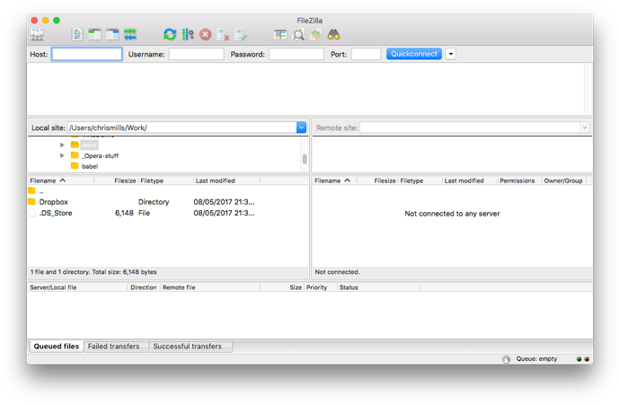
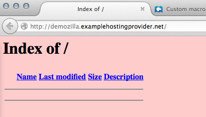
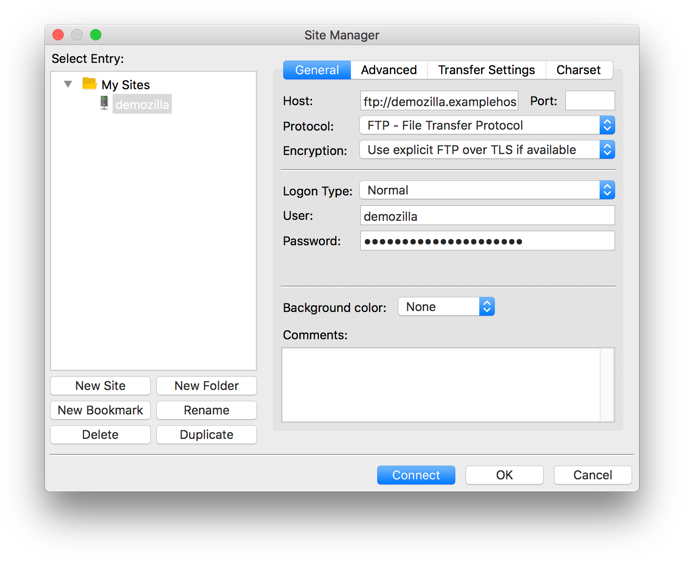
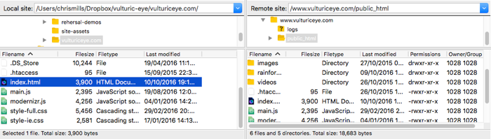
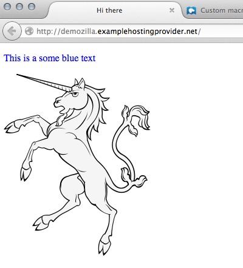

웹서버에 파일 업로드
--------------------

이 문서는 저작자 동의없이 KAIST 대학정보화사업팀을 위하여 [How do you upload your files to a web server?](https://developer.mozilla.org/en-US/docs/Learn/Common_questions/Upload_files_to_a_web_server)를 번역 편집하여 작성한 것입니다.

이 페이지에서는 파일 전송 도구를 사용하여 온라인으로 사이트에 게시하는 방법을 설명합니다.

> 선수지식: [웹서버가 무엇이며](whatIsWebserver.md), [도메인 이름은 어떻게 작동하는지](https://developer.mozilla.org/en-US/Learn/Understanding_domain_names) 알아야합니다. 또한 [기본 환경을 설정하는 방법](https://developer.mozilla.org/en-US/Learn/Set_up_a_basic_working_environment)과 [간단한 웹 페이지를 작성하는 방법](https://developer.mozilla.org/en-US/Learn/HTML/Write_a_simple_page_in_HTML)도 알고 있어야합니다.
>
> 목표: 사용 가능한 다양한 파일 전송 도구를 사용하여 웹서버로 파일을 푸시하는 방법에 대해 알아봅니다.

### 요약

간단한 웹 페이지([HTML 기본](https://developer.mozilla.org/en-US/docs/Learn/Getting_started_with_the_web/HTML_basics) 페이지의 예를 참조)를 작성하였다면, 웹서버에 온라인으로 보낼 수 있습니다. 여기에서는 SFTP 클라이언트, RSync 및 GitHub와 같은 다양한 도구를 사용하는 방법에 대해 설명합니다.

### SFTP

다양한 SFTP 클라이언트가 있습니다. 무료이며 Windows, macOS 및 Linux에서 모두 사용 가능한 [FileZilla](https://filezilla-project.org/)에 대하여 설명합니다. FileZilla를 설치하려면 [FileZilla 다운로드 페이지](https://filezilla-project.org/download.php?type=client)로 이동하여 다운로드 버튼을 클릭한 다음 설치 프로그램을 수행하는 일반적인 방법으로 설치하십시오.

> **Note** : 다른 방법도 많이 있습니다. 자세한 내용은 [게시 도구](https://developer.mozilla.org/en-US/Learn/How_much_does_it_cost#Publishing_tools.3A_FTP_client)를 참조하십시오.

FileZilla 응용 프로그램을 실행하면 아래과 같은 화면이 보입니다.

#### 로그인

예에서는 (HTTP 웹서버를 호스팅 서비스를 제공하는)호스팅 공급자 URL이 mypersonalwebsite.examplehostingprovider.net인 가상 회사 "examplehostingprovider"라고 가정합니다.

계정을 개설하고 아래의 정보를 받았습니다.

---

<code>

Congratulations for opening an account at Example Hosting Provider.

Your account is: demozilla

Your website will be visible at demozilla.examplehostingprovider.net

To publish to this account, please connect through SFTP with the following credentials:

-	SFTP server: sftp://demozilla.examplehostingprovider.net
-	Username: demozilla
-	Password: quickbrownfox
-	Port: 5548
-	To publish on the web, put your files into the Public/htdocs directory.

</code>

---

먼저 <code>http://demozilla.examplehostingprovider.net/</code>을 보겠습니다. 아래와 같이 아직 아무 것도 없습니다.

> **Note** : 호스팅 업체에 따라 웹 주소로 처음 이동할 때 "이 웹 사이트는 [호스팅 서비스]에 의해 호스팅됩니다."와 같은 메시지가 표시되기도 합니다.

SFTP 클라이언트를 원격 서버에 연결하기 위하여 다음 단계를 수행합니다.

1.	메인 메뉴에서 <i>File > Site Manager ...</i>를 선택하십시오.
2.	<i>Site Manager</i> 창의 <i>New Site</i> 버튼을 누른 다음, <b>demozilla</b>라는 사이트 이름을 입력하십시오.
3.	<i>Host:</i> 필드에 호스트 업체가 제공하는 SFTP 서버 주소를 입력합니다.
4.	<i>Logon Type</i>: 드롭다운 메뉴에서 <i>Normal</i>을 선택한 다음 해당 필드에 username과 password를 입력하십시오.
5.	정확한 port 및 기타 정보를 입력하십시오.

위의 단계를 수행하면 아래과 같이 보일 것입니다.

이제 <i>Connect</i>를 눌러 SFTP 서버에 연결하십시오.

> **Note** : 호스팅 업체가 사용자에게 SFTP(Secure FTP) 연결을 제공하는지 확인하십시오. FTP는 본질적으로 안전하지 않으므로 사용하지 않아야 합니다.

#### 로컬 및 원격 뷰

연결되면 다음과 같은 화면이 나타납니다 (설명를 위해 위의 예를 계속하여 사용).

윗 화면에 대하여 살펴봅니다.

-	가운데 왼쪽 pane에서 로컬 파일들을 볼 수 있습니다. 웹 사이트를 저장할 디렉토리(예 : <code>mdn</code>)로 이동합니다.
-	가운데 오른쪽 pane에는 원격 파일들이 표시됩니다. 원격으로 FTP 루트에 로그인했습니다 (이 경우 <code>users/demozilla</code>).
-	여기에서 하단과 상단 pane에 대하여 자세히 설명하지 않습니다. 이들 각각은 컴퓨터와 SFTP 서버 간의 연결 상태를 보여주는 메시지 로그와 SFTP 클라이언트와 서버 간의 모든 상호 작용에 대한 라이브 로그입니다.

#### 서버로 업로드

예에서 "웹에 게시하려면 파일을 <code>Public/htdocs</code> 디렉토리에 저장하십시오."를 설명합니다. 오른쪽 pane에서 지정한 디렉토리로 이동해야 합니다. 이 디렉토리는 웹 사이트의 루트입니다. <code>index.html</code> 파일과 컨텐트를 저장하고 있습니다.

파일을 옮길 정확한 원격 디렉토리를 찾으면 파일을 왼쪽 창에서 오른쪽 창으로 끌어다 놓아 파일을 업로드합니다.

#### 온라인?

여기까지 무사히 따라 하였지만 브라우저에서 볼 수 있을까요? 브라우저에서 웹 사이트 (예 : <code>http://demozilla.examplehostingprovider.net/</code>)로 가서 확인할 수 있습니다.

와! 웹 사이트가 작동합니다.

### Rsync

[Rsync](https://developer.mozilla.org/en-US/docs/Glossary/Rsync)는 로컬에서 원격으로 파일을 동기화하는 도구입니다. 일반적으로 대부분 Unix 기반 시스템 (예 : macOS 및 Linux)에서 사용할 수 있지만 Windows 버전도 있습니다.

SFTP보다 앞선 도구로 보여지며 기본적으로 CLI(command line)로 사용합니다. 기본 명령은 다음과 같습니다.

> <code> rsync [-options] SOURCE user@x.x.x.x:DESTINATION</code>

-	<code>-options</code>은 하나 이상의 문자가 오는 "-"입니다 (예: 자세한 오류 메시지를 보기 원하면 <code>-v</code>, 백업이 필요하면 <code>-b</code>). [rsync man 페이지](https://linux.die.net/man/1/rsync)에서 전체 목록을 볼 수 있습니다("Option summary"로 검색).
-	<code>SOURCE</code>는 파일을 복사하려는 로컬 파일 또는 디렉토리의 경로입니다.
-	<code>user@</code>는 파일을 복사할 원격 서버의 사용자 자격 증명입니다.
-	<code>x.x.x.x</code>는 원격 서버의 IP 주소입니다.
-	<code>DESTINATION</code>은 원격 서버의 디렉토리 또는 파일을 복사할 위치 경로입니다.

호스팅 제공 업체로부터 이러한 세부 정보를 얻어야 합니다.

자세한 내용과 예제는 [How to Use Rsync to Copy/Sync Files Between Servers](https://www.atlantic.net/hipaa-compliant-cloud-hosting-services/how-to-use-rsync-copy-sync-files-servers/)를 참조하십시오.

물론 FTP를 사용할 때와 같이 보안 연결을 사용하는 것이 좋습니다. Rsync의 경우 <code>-e</code> 옵션을 사용하여 SSH 세부 정보를 지정함으로써 SSH를 사용하는 연결을 설정할 수 있습니다.

> <code> rsync [-options] -e "ssh [SSH DETAILS GO HERE]" SOURCE user@x.x.x.x:DESTINATION</code>

[How To Copy Files With Rsync Over SSH](https://www.digitalocean.com/community/tutorials/how-to-copy-files-with-rsync-over-ssh)에서 보다 자세한 내용을 볼 수 있습니다.

#### Rsync GUI 도구

다른 CLI 도구와 마찬가지로 CLI 사용에 익숙하지 않은 사용자를 위해 Rsync용 GUI 도구도 있습니다. [Acrosync](https://acrosync.com/mac.html)는 이러한 도구중 하나이며 Windows 및 macOS에서 사용할 수 있습니다.

다시 말하지만 호스팅 업체의 연결 자격 증명을 얻어 GUI도구를 사용하여 이를 입력할 수도 있습니다.

### GitHub

GitHub를 사용하면 [GitHub 페이지](https://pages.github.com/) (gh-pages)를 통해 웹 사이트를 게시할 수 있습니다.

[웹 시작하기](https://developer.mozilla.org/en-US/Learn/Getting_started_with_the_web)의 [웹 사이트 게시](https://developer.mozilla.org/en-US/Learn/Getting_started_with_the_web/Publishing_your_website) 페이지에서 이 기능을 사용하는 기본 사항을 다뤘으므로 여기서 다시 설명하지 않겠습니다.

그러나 GitHub에서 웹 사이트를 호스팅할 수 있으며 이를 위하여 사용자 정의 도메인을 이용할 수도 있습니다. 자세한 내용은 [GitHub Pages에서 사용자 정의 도메인 사용](https://help.github.com/articles/using-a-custom-domain-with-github-pages/)을 참조하십시오.

### 파일을 업로드할 수 있는 다른 방법

FTP 프로토콜은 웹 사이트에 페이지를 게시하기 위한 잘 알려진 방법 중 하나이지만, 유일한 방법은 아닙니다. 다음은 몇 가지 다른 방법입니다.

-	**Web interfaces.** 원격 파일 업로드 서비스의 프런트 엔드 역할을 하는 HTML 인터페이스입니다. 호스팅 서비스에서 제공됩니다.
-	**[WebDAV](https://developer.mozilla.org/en-US/docs/Glossary/WebDAV).** 고급 파일 관리를 위하여 HTTP 프로토콜을 확장한 것입니다.
