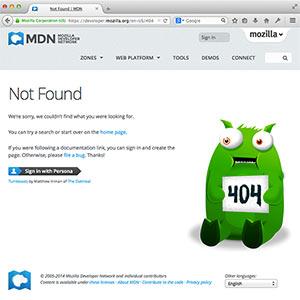

웹서버란?
---------

이 문서는 저작자 동의없이 KAIST 대학정보화사업팀을 위하여 [What is web server?](https://developer.mozilla.org/en-US/docs/Learn/Common_questions/What_is_a_web_server)를 번역 편집하여 작성한 것입니다.

이 페이지는 웹 서버는 무엇이며, 작동 방식 및 중요성에 대해 설명합니다.

> 선수지식: [인터넷 동작 방식](https://developer.mozilla.org/en-US/docs/Learn/Common_questions/How_does_the_Internet_work)을 알고 있어야하며 [웹 페이지, 웹 사이트, 웹 서버 및 검색 엔진의 차이를 이해하고](https://developer.mozilla.org/en-US/docs/Learn/Common_questions/Pages_sites_servers_and_search_engines) 있어야 합니다.
>
> 목표: 웹 서버가 무엇인지 배우며, 웹 서버의 전반적인 작동을 이해합니다.

### 요약

"웹서버"는 하드웨어 또는 소프트웨어 또는 모두를 함께 지칭할 수 있습니다.

1.	하드웨어 관점에서 웹 서버는 웹 서버 소프트웨어와 웹 사이트를 구성하는 파일 (예 : HTML 문서, 이미지, CSS 스타일 시트 및 JavaScript 파일)을 저장하는 컴퓨터를 일컬으며 인터넷에 연결되어 웹에 연결된 다른 장치와 물리적 인 데이터 교환을 지원합니다.
2.	소프트웨어 관점에서 웹 서버는 HTTP 서버에서 웹 사용자가 저장된 파일을 접근을 제어하는 여러 부분을 최소한으로 포함하고 있습니다. HTTP 서버는 URL (웹 주소) 및 HTTP (브라우저가 웹 페이지를 보여 주는 데 사용하는 프로토콜)를 이해하는 소프트웨어입니다. 저장하는 웹 사이트의 도메인 이름 (예 : mozilla.org)을 통해 접근할 수 있으며 해당 내용을 최종 사용자의 단말기에 전달합니다.

가장 기본적인 수준에서, 브라우저가 웹서버가 저장하고 있는 파일이 필요하면 브라우저는 HTTP를 사용하여 파일을 요청합니다. 요청이 지정된 웹서버 (하드웨어)에 도달하면 HTTP 서버 (소프트웨어)는 요청을 받아들이고 요청된 문서를 찾아 (없으면 오류 응답 404 을 반환한다.) HTTP를 통해 브라우저로 보냅니다

웹 사이트를 게설하려면 정적 또는 동적 웹서버가 필요합니다.

**정적 웹서버** 또는 스택은 HTTP 서버 (소프트웨어)를 설치한 컴퓨터 (하드웨어)로 구성됩니다. 서버가 저장한 파일을 "있는 그대로" 브라우저로 전송하기 때문에 이를 "정적"이라고합니다.

<b>동적 웹서버</b>는 정적 웹 서버에 일반적으로 응용 프로그램 서버 및 데이터베이스 등의 소프트웨어를 추가하여 구성됩니다. 응용 프로그램 서버가 HTTP 서버를 통해 브라우저로 보내기 전에 저장된 파일을 업데이트하기 때문에 이를 "동적"이라고합니다.

예를 들어, 브라우저에서 볼 수있는 최종 웹 페이지를 생성하려면 응용 프로그램 서버가 데이터베이스의 내용으로 HTML 템플리트를 사용하여 웹 페이지를 완성합니다. MDN이나 Wikipedia와 같은 사이트는 수천 개의 웹 페이지를 가지고 있지만 실제 HTML 문서가 아니며 HTML 템플릿 몇 개와 거대한 데이터베이스입니다. 이렇게 설정하면 콘텐츠를 보다 쉽고 빠르게 유지 관리하고 제공 할 수 있습니다.

### 자습

### 보다 자세한 설명

이미 설명했듯이 웹 페이지를 가져 오려면 브라우저가 웹서버에 요청을 보내고 요청된 파일을 서버의 저장 장치에서 검색합니다. 파일을 찾으면 서버는 파일을 읽고 필요하면 이를 처리한 다음 브라우저로 보냅니다. 이 단계를 자세히 살펴 보겠습니다.

#### 호스팅 파일

웹 서버는 먼저 이미지, CSS 스타일 시트, JavaScript 파일, 글꼴 및 비디오를 비롯한 HTML 문서를 구성하는 모든 요소들을 웹 사이트의 파일로 저장해야 합니다.

기술적으로 모든 파일을 사용자 컴퓨터에 저장하여 사용할 수는 있지만,

-	항상 가동되고,
-	인터넷에 항상 연결되어 있고,
-	항상 동일한 IP 주소를 갖고 (모든 ISP가 홈 라인에 고정 IP 주소를 제공하지는 않음),
-	타 공급자가 관리하는

전용 웹 서버에 모든 파일을 저장하는 것이 훨씬 편리합니다.

이러한 모든 이유로, 좋은 호스팅 제공 업체를 찾는 것은 웹 사이트를 구축하는 핵심 요소입니다. 업체가 제공하는 다양한 서비스를 자세히 살펴보고 요구사항과 예산에 맞는 서비스를 선택하십시오 (이러한 서비스는 무료에서 매월 수천 달러까지 이릅니다). 자세한 내용을 [여기](https://developer.mozilla.org/en-US/Learn/How_much_does_it_cost#Hosting)에서 볼 수 있습니다.

웹 호스팅 솔루션을 설정하면 [웹서버에 파일을 업로드](https://developer.mozilla.org/en-US/docs/Learn/Upload_files_to_a_web_server)만 하면 됩니다.

#### HTTP를 통한 통신

둘째, 웹 서버는 HTTP(<b>H</b>yper<b>t</b>ext <b>T</b>ransfer <b>P</b>rotocol)를 지원합니다. 이름에서 알 수 있듯이 HTTP는 두 컴퓨터간 하이퍼 텍스트 (즉, 링크된 웹 문서)를 전송하는 방법을 지정합니다.

프로토콜은 두 컴퓨터 간의 통신 규칙입니다. HTTP는 텍스트 형식의 상태를 저장하지 않는(stateless) 프로토콜입니다.

**텍스트**

모든 명령은 일반 텍스트이며 사람이 읽을 수 있습니다.

**Stateless**

서버와 클라이언트 모두 이전 통신을 기억하지 않습니다. 예를 들어, HTTP만으로 서버는 입력한 암호나 수행중인 트랜잭션의 실행 단계를 기억할 수 없습니다. 그런 작업을 위해서는 응용 프로그램 서버가 필요합니다. (다른 페이지에서 그런 종류의 기술을 다루겠습니다.)

HTTP는 클라이언트와 서버가 통신하는 방법에 대하여 명확한 규칙을 제공합니다. [다른 패이지](https://developer.mozilla.org/en-US/docs/Web/HTTP)에서 HTTP 자체에 대해 다룰 것입니다. 지금 다음 사항에 유의하십시오.

-	클라이언트만 HTTP 요청할 수 있으며 서버로만 보낼 수 있습니다. 서버는 클라이언트의 HTTP 요청에만 응답할 수 있습니다.
-	HTTP를 통해 파일을 요청할 때 클라이언트는 파일의 URL을 보내야 합니다.
-	웹서버는 모든 요청에 대하여 오류 메시지라도 응답해야 합니다.

웹서버에서 HTTP 서버는 들어오는 요청을 처리하고 응답하는 일을 담당합니다.

1.	요청을 받으면 HTTP 서버는 요청된 URL이 저장되어 있는 파일과 일치하는지 먼저 확인합니다.
2.	있으면 웹서버는 파일 내용을 다시 브라우저로 보냅니다. 그렇지 않으면 응용 프로그램 서버는 필요한 파일을 만듭니다.
3.	위의 두 경우에 모두 해당되지 않으면 웹서버는 일반적으로 [404 Not Found](https://developer.mozilla.org/en-US/docs/Web/HTTP/Status/404)라는 오류 메시지를 브라우저에 반환합니다. (그 오류는 너무나 자주 발생하여 많은 웹 디자이너들이 [404 오류 페이지](http://www.404notfound.fr/)를 디자인하는데 많은 시간을 투자합니다.)

#### 정적과 동적 페이지

서버는 정적 또는 동적 컨텐트를 제공할 수 있습니다. "정적"은 "제공된 그대로"를 의미합니다. 정적 웹 사이트를 만드는 것이 가장 쉽기 때문에 처음 사이트를 만든다면 정적 사이트로 만들 것을 권장합니다.

"동적"은 서버가 콘텐츠를 처리하거나 심지어 데이터베이스로 부터 요청시 생성하는 것을 의미합니다. 이 방법은 유연성을 제공하지만 기술 스택 처리가 더 어려워 지므로 웹 사이트 구축이 훨씬 복잡해 집니다.

예를 들어 지금 읽고 있는 페이지를 예로 들어 보겠습니다. 호스팅하는 웹서버는 데이터베이스의 콘텐츠를 가져 와서, 포맷하고, HTML 템플릿을 채워 그 결과를 보내는 응용 서버가 있습니다. 이 경우 [Kuma](https://developer.mozilla.org/en-US/docs/MDN/Kuma)라고 부르는 응용 서버는 ([Django](https://www.djangoproject.com/) 프레임워크를 사용하여) [Python](https://www.python.org/)으로 작성되었습니다 . 모질라 팀은 MDN의 특정 요구에 맞게 Kuma를 만들었지만 다른 기술을 기반으로 작성된 유사한 응용 프로그램들도 많습니다.

너무 많은 응용 프로그램 서버가 있어 특정 응용 서버를 제안하기는 매우 어렵습니다. 일부 응용 서버는 블로그, 위키 또는 전자 상점과 같은 특정 웹 사이트를 위하여 만들어 졌습니다. 보다 일반적인 CMS (콘텐츠 관리 시스템)라고하는 응용 서버도 있습니다. 역동적인 웹 사이트를 구축하려면 시간을 투자하여 적합한 도구를 선택하십시오. 흥미로운 영역인 웹 서버 프로그래밍을 배우고 싶지 않으면 자신만의 응용 서버를 만들 필요는 없습니다. 그것이 바로 [바퀴를 재발명하고](https://en.wikipedia.org/wiki/reinventing%20the%20wheel) 있는 것입니다.

### 다음 단계

이제 웹서버에 익숙해졌습니다. 아래 사항들애 대하여 알아봅니다.

-	[웹에서 응용을 수행하는데 필요한 비용](https://developer.mozilla.org/en-US/docs/Learn/Common_questions/How_much_does_it_cost)
-	[웹 사이트 구축에 필요한 다양한 소프트웨어](whatSoftwareNeeded.md)
-	[웹서버에 파일을 업로드하는 방법](https://developer.mozilla.org/en-US/docs/Learn/Common_questions/Upload_files_to_a_web_server)과 같은 실용적인 기술
