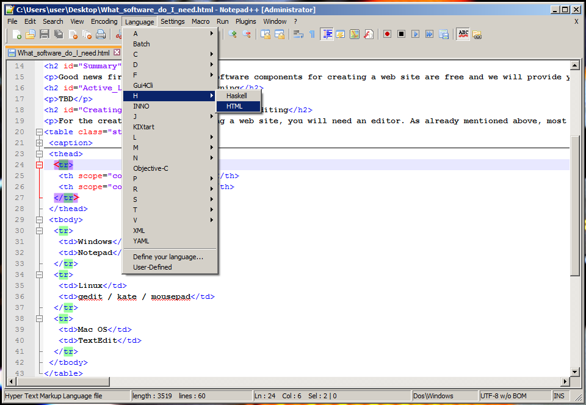
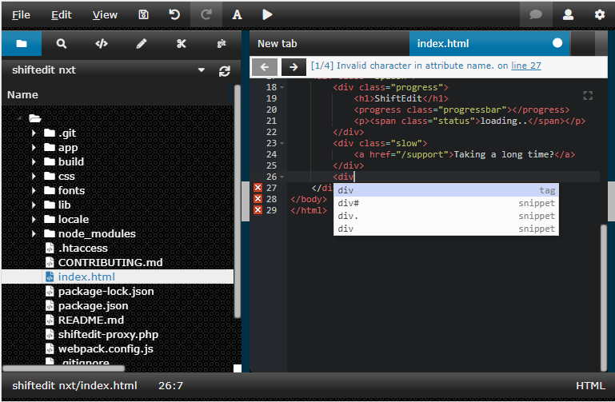

웹사이트 구축에 필요한 다양한 소프트웨어
----------------------------------------

이 문서는 저작자 동의없이 KAIST 대학정보화사업팀을 위하여 [What Software do I need to build a website?](https://developer.mozilla.org/en-US/docs/Learn/Common_questions/What_software_do_I_need)를 번역 편집하여 작성한 것입니다.

이 페이지는 웹 사이트를 편집, 업로드 또는 볼 때 필요한 소프트웨어 구성 요소에 대해 설명합니다.

> 선수지식: [웹 페이지, 웹 사이트, 웹 서버 및 검색 엔진의 차이를 이해하고](https://developer.mozilla.org/en-US/docs/Learn/Common_questions/Pages_sites_servers_and_search_engines) 있어야 합니다.
>
> 목표: 웹 사이트를 편집, 업로드 또는 볼 때 필요한 소프트웨어 구성 요소에 대해 학습합니다.

### 요약

웹 개발에 필요한 대부분 프로그램은 무료로 다운로드 받을 수 있습니다. 이 페이지에서 몇몇 링크를 제공 할 것입니다.

아래과 같은 도구가 필요합니다.

-	웹 페이지 만들기 및 편집
-	웹서버에 파일 업로드
-	웹 사이트 보기

거의 모든 운영 체제에는 기본적으로 텍스트 편집기와 웹 사이트를 보는 데 사용하는 브라우저가 포함되어 있습니다. 결과적으로 파일을 웹서버에 보내기 위한 소프트웨어만 필요합니다.

### 자습

### 보다 자세한 설명

#### 웹 페이지 만들기 및 편집

웹 사이트를 만들고 편집하려면 텍스트 편집기가 필요합니다. 텍스트 편집기를 사용하여 서식없는 텍스트 파일을 작성하고 수정할 수 있습니다. RTF와 같은 다른 형식을 사용하면 **굵게** 또는 <u>밑줄</u>과 같은 서식을 추가 할 수 있습니다. 그러나 이러한 형식은 웹 페이지를 작성하는 데 적합하지 않습니다. 웹 사이트를 구축에는 광범위한 작업이 필요하므로 텍스트 편집기를 사용을 고려하여야 합니다.

모든 데스크탑 운영 체제는 기본 텍스트 편집기를 포함하고 있습니다. 이 편집기는 간단하여 웹 페이지 작성을 위한 특별한 기능은 없습니다. 보다 편리한 기능을 원하는 경우 가용한 많은 서드파티 도구를 이용할 수 있습니다. 서드파티 편집기에는 구문 색 지정, 자동 완성, 섹션 접기, 코드 검색 등의 추가 기능을 제공합니다. 다음은 편집기 목록입니다.

<table>
  <tr>
    <th>운영체제</th>
    <th>기본 편집기</th>
    <th>서드파티 편집기</th>
  </tr>
  <tr>
    <td rowspan="6">Windows</td>
    <td rowspan="6"> <a href="http://en.wikipedia.org/wiki/Notepad_%28software%29">NotePad</a> </td>
    <td><a href="http://notepad-plus-plus.org/">NotePad++</a> </td>
  </tr>
  <tr>
    <td><a href="https://www.visualstudio.com/">Visual Studio Code</a></td>
  </tr>
  <tr>
    <td><a href="https://www.jetbrains.com/webstorm/">Web Storm</a></td>
  </tr>
  <tr>
    <td><a href="http://brackets.io/">Brackets</a></td>
  </tr>
  <tr>
    <td><a href="https://shiftedit.net/">ShiftEdit</a></td>
  </tr>
  <tr>
    <td><a href="https://www.sublimetext.com/">Sublime Text</a></td>
  </tr>
  <tr>
    <td rowspan="5">Mac OS</td>
    <td rowspan="5"><a href="http://en.wikipedia.org/wiki/TextEdit">TextEdit</a></td>
    <td> <a href="http://www.barebones.com/products/textwrangler/">TextWrangler</a></td>
  </tr>
  <tr>
    <td><a href="https://www.visualstudio.com/">Visual Studio Code</a></td>
  </tr>
  <tr>
    <td><a href="http://brackets.io/">Brackets</a></td>
  </tr>
  <tr>
    <td><a href="https://shiftedit.net/">ShiftEdit</a></td>
  </tr>
  <tr>
    <td><a href="https://www.sublimetext.com/">Sublime Text</a></td>
  </tr>
  <tr>
    <td rowspan="6">Linux</td>
    <td rowspan="6"><a href="http://en.wikipedia.org/wiki/Vi">Vi</a> (All UNIX)
    

    <a href="http://en.wikipedia.org/wiki/Kate_%28text_editor%29">GEdit</a> (Gnome)
    

    <a href="http://en.wikipedia.org/wiki/Kate_%28text_editor%29">Kate</a> (KDE)
    

    <a href="http://en.wikipedia.org/wiki/Kate_%28text_editor%29">LeafPad</a> (Xfce)
    </td>
    <td><a href="http://www.gnu.org/software/emacs/">Emacs</a></td>
  </tr>
  <tr>
    <td><a href="http://www.vim.org/">Vim</a></td>
  </tr>
  <tr>
    <td><a href="https://www.visualstudio.com/">Visual Studio Code</a></td>
  </tr>
  <tr>
    <td><a href="http://brackets.io/">Brackets</a></td>
  </tr>
  <tr>
    <td><a href="https://shiftedit.net/">ShiftEdit</a></td>
  </tr>
  <tr>
    <td><a href="https://www.sublimetext.com/">Sublime Text</a></td>
  </tr>
  <tr>
  <td>Chrome OS</td>
  <td> </td>
  <td><a href="https://shiftedit.net/">ShiftEdit</a></td>
  </tr>
</table>

다음은 고급 텍스트 편집기의 스크린 샷입니다.

다음은 온라인 텍스트 편집기의 스크린 샷입니다.

#### 웹서버에 파일 업로드

웹 사이트가 공개 될 준비가되면 웹 서버에 웹 페이지를 업로드해야 합니다. 다양한 공급자로부터 서버의 공간을 구입할 수 있습니다 ([웹에서 응용을 수행하는데 필요한 비용](https://developer.mozilla.org/en-US/docs/Learn/Common_questions/How_much_does_it_cost) 참조). 사용할 공급자를 결정하면 공급자는 일반적으로 SFTP URL 형태로 사용자 이름, 암호 및 해당 서버에 연결하는 데 필요한 정보 즉 접근 정보를 전자 메일로 전송합니다. (S)FTP는 다소 오래되었고, 다른 업로드 시스템에서는 보편화되기 시작한 RSync와 Git/GitHub을 사용하기도 합니다.

> **Note** : FTP는 본질적으로 안전하지 않습니다. 호스팅 제공 업체는 SSH를 통한 SFTP 또는 RSync와 같은 보안 연결을 사용할 수 있도록 해야 합니다.

웹서버에 파일을 업로드하는 것은 웹 사이트를 만드는 데에 있어서 매우 중요한 단계이므로 별도로 자세히 설명합니다. 다음은 무료 기본 (S)FTP 클라이언트의 목록입니다.

<table>
  <tr>
    <th>운영체제</th>
    <th colspan="2">FTP 소프트웨어</th>
  </tr>
  <tr>
    <td rowspan="2">Windows</td>
    <td><a href="http://winscp.net/">WinSCP</a></td>
    <td rowspan="5"><a href="https://filezilla-project.org/">FileZilla (All OS)</a></td>
  </tr>
  <tr>
    <td><a href="http://mobaxterm.mobatek.net/">Moba Xterm</a></td>
  </tr>
  <tr>
    <td rowspan="2">Linux</td>
    <td><a href="https://wiki.gnome.org/action/show/Apps/Files?action=show&redirect=Apps%2FNautilus">Nautilus/Files</a> (Gnome)</td>
  </tr>
  <tr>
    <td><a href="http://dolphin.com/">Dolphin</a> (KDE)</td>
  </tr>
  <tr>
    <td>Mac OS</td>
    <td><a href="http://dolphin.com/">Cyberduck</a></td>
  </tr>
  <tr>
    <td>Chrome OS</td>
    <td><a href="https://shiftedit.net/">ShiftEdit</a></td>
    <td></td>
  </tr>
</table>

#### 웹 사이트 브라우징

이미 알고 있듯이 웹 사이트를 보려면 웹 브라우저가 필요합니다. 개인 용도로 사용할 수 있는 브라우저는 [수십 가지](http://en.wikipedia.org/wiki/List_of_web_browsers)가 있지만 웹 사이트를 개발할 때 최소한 다음 주요 브라우저에서 테스트하여 사이트가 대부분의 사람들에게 잘 작동하는지 확인해야 합니다.

- [Mozilla Firefox](https://www.mozilla.org/en-US/firefox/new/)
- [Google Chrome](https://www.google.fr/chrome/browser/)
- [Microsoft Internet Explorer](http://windows.microsoft.com/en-US/internet-explorer/download-ie)
- [Apple Safari](http://www.apple.com/safari/)

기술 플랫폼 또는 국가와 같이 특정 그룹이 사용자인 경우 [Opera](http://www.opera.com/), [Konqueror](http://www.konqueror.org/) 또는 [UC Browser](http://www.ucweb.com/ucbrowser/)와 같은 추가 브라우저로 사이트를 테스트해야 할 수도 있습니다.

그러나 일부 브라우저는 특정 운영 체제에서만 실행되기 때문에 테스트가 복잡해집니다. Apple Safari는 iOS 및 Mac OS에서 실행되는 반면 Internet Explorer는 Windows에서만 실행됩니다. [Browsershots](http://browsershots.org/) 또는 [Browserstack](http://www.browserstack.com/)과 같은 서비스를 이용하는 것이 가장 좋습니다. Browsershots는 다양한 브라우저에서 볼 수 있도록 웹 사이트의 스크린 샷을 제공합니다. Browserstack은 실제로 가상 머신에 대한 완벽한 원격 액세스를 제공하므로 가장 일반적인 환경에서 사이트를 테스트 할 수 있습니다. 또는 자체 가상 머신을 설정할 수도 있지만 전문 지식이 필요합니다. (만약 당신이 그렇게 하고 있다면, 마이크로소프트는 [modern.ie](https://modern.ie/)에서 사용 가능한 가상 머신을 포함한 개발 도구를 제공합니다.)

모든 방법을 동원하여 실제 장치에서 몇 가지 테스트를 수행하십시오.  특히 실제 모바일 장치의 경우 그렇습니다. 모바일 장치 시뮬레이션은 새롭고 진화하는 기술이어서 데스크톱 시뮬레이션보다 안정성이 떨어집니다. 물론 휴대 기기는 돈이 들기 때문에 [Open Device Lab 이니셔티브](http://opendevicelab.com/)를 살펴 볼 것을 제안합니다. 많은 지출없이 많은 플랫폼에서 테스트하려 할떄 장치를 공유 할 수도 있습니다.

### 다음 단계

- 이 소프트웨어 중 일부는 무료이지만 모두는 아닙니다. [웹에서 응용을 수행하는데 필요한 비용](https://developer.mozilla.org/en-US/docs/Learn/Common_questions/How_much_does_it_cost)을 알아보십시오.
- 텍스트 편집기에 대해 자세히 알기 원하면 [텍스트 편집기를 선택하고 설치하는 방법](https://developer.mozilla.org/en-US/docs/Learn/Choose,_Install_and_set_up_a_text_editor)에 대한 페이지를 보십시오.
- 웹에 웹 사이트를 게시하는 방법에 대해 궁금한 점이 있다면 ["웹 서버에 파일을 업로드하는 방법"](https://developer.mozilla.org/en-US/docs/Learn/Common_questions/Upload_files_to_a_web_server)을 살펴보십시오.
