효과적인 코드 리뷰 (Effective Code Review)
==========================================

이 문건은 Brian Liu가 작성한 [블로그](https://engineering.linecorp.com/en/blog/effective-code-review/?fbclid=IwAR27bOf1o5sYJrO6YW9R58BRezLjWtK7OXG0O4qcJkA80klNQpH1LCdGKGg)를 번역한 것입니다. 아직 저자나 Line으로부터 저작권에 관련하여 번역에 대한 승인을 얻지 못한 것으로 우리 팀 내부용으로 사용하는 것을 권장합니다.

translated and edited by <a href="mailto:yoonjoon.lee@kaist.edu">이윤준</a>

소프트웨어 개발팀에서 코드 품질이 중요한 문제중 하나입니다. 팀원들은 개발을 시작하면 단위 테스트 및 코드 적용 범위를 개선할 수 있는 방법에 대해 이야기하기 시작합니다. 그러나 개발 종료가 가까워져 시간에 좆기면 더 이상 뜨거운 주제가 아닙니다. 그러나 다음 개발에서도 같은 생각이 다시 들며 머지않아 데자뷰를 경험하고 반복하게 될 것입니다. 이 글은 LINE NOW의 테스트 자동화를 담당하는 소프트웨어 엔지니어 브라이언 리우 (Bryan Liu)님이 LINE Taiwan에서 단위 테스트 및 코드 검토 프로세스를 용이하게 하기 위해 한 일을 공유하기 위하여 작성한 것입니다.

단위 테스트 및 코드 검토 (Unit test and code review)
----------------------------------------------------

CTO가 OJT 기간 동안 우리에게 동료 코드 검토는 LINE의 엔지니어 문화의 일부이라고 설명해였습니다. Facebook에서는 소프트웨어 개발에서 가장 중요한 세 가지 사항으로 코드 검토, 코드 검토 및 코드 검토라고 합니다. 맞습니다, 단위 테스트를 수행하고 코드 품질을 향상시킬 수 있는 유일한 방법은 단위 테스트를 소프트웨어 엔지니어 문화의 일부로 만드는 것이며 이때 코드 검토는 도움을 줄 것입니다.

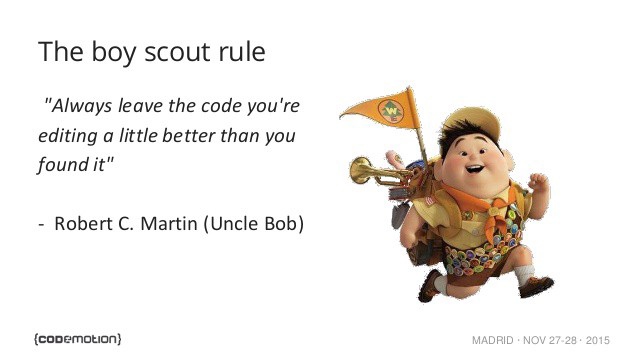
Boy scout rule for coding, from {<a href="https://codemotionworld.com/">codemotion</a>\}

검토 과정에서 검토자는 새롭게 더해진 코드 및 버그 수정에 대하여 단위 테스트를 수행하였는지 점검하여야 하며 이를 지속적으로 수행하여야 합니다. 이러한 스카우트 규칙을 따르는 결과로 코드 커버리지 (code coverage)가 향상되거나 적어도 동일하게 유지되어야 합니다. 코드 커버리지가 떨어졌다면 개발자는 자신의 어려움과 더 많은 데스트를 수행하지 못한 이유를 설명하여야 합니다. 팀원 모구 그 설명에 동의하고 문제가 없다면 개발자는 계속 진행할 수 있으며 그렇지 않은 경우 개발자는 이를 개선하여야 합니다.

효과적인 코드 리뷰를 위한 팁 (Tips for effective code review)
-------------------------------------------------------------

코드 검토를 가장 효율적으로 수행하는 방법은 페어 프로그래밍이지만 Github에서 PR (Pull Request)을 사용하는 것이 팀에 더 적합하다면 이 또한 좋은 방법입니다. 코드 검토를 실제로 잘 수행하려면 코드 검토 프로세스의 효율성을 높이려고 노력해야 합니다. 팀의 목표는 코드 검토가 아니므로 아이디어는 리뷰어를 외계인으로 취급하는 것입니다.

다음은 효과적이고 효율적인 코드 검토를 위한 몇 가지 팁입니다.

-	[변경은 가급적 작게](#keep_change_small)
-	[자주 검토하고 검토 세션은 짧게](#review_often_and_shorten_sessions)
-	[신속한 검토 PR 보내기](#send_pull_request_for_review)
-	[의미있는 PR을 위한 충분한 컨텍스트 제공](#provide_enough_context)
-	[linting 및 코드 스타일 검사](#linting_code_style)

### 
변경을 가급적 작게

시스코 시스템의 프로그래밍팀 연구에 따르면 200 ~ 400 LoC (코드 라인)에 대해 60 ~ 90 분 동안 검토하면 70 ~ 90%의 결함을 찾을 수 있다고 합니다. 적절한 크기의 기능, 버그 수정으로 각 PR을 수행하거나 PR에 의미있는 단위로 수행하십시요. [이 문서](https://smallbusinessprogramming.com/optimal-pull-request-size/)는 큰 PR이 적절하지 못한 이유와 적절한 PR 크기에 대하여 설명하고 있습니다.

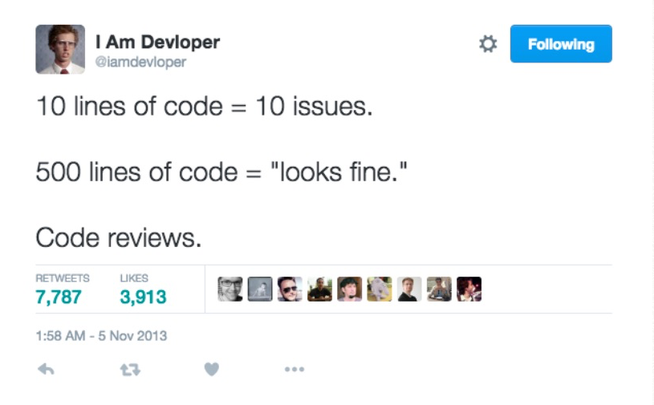

Code reviews, from <a href="https://twitter.com/iamdevloper">@iamdeveloper</a> on Twitter & Defect density vs LoC, from <a href="https://smartbear.com/learn/code-review/best-practices-for-peer-code-review/">Cisco study case

### 
자주 검토하고 검토 세션은 짧게

느린 속도로 제한된 시간 동안 적당량의 코드 리뷰를 수행하면 효과적인 코드 검토를 할 수 있습니다. 400 LoC 이상이면 찾아내는 결함이 줄어듭니다. 300 LoC/hr에서 검사율이 가장 좋습니다.

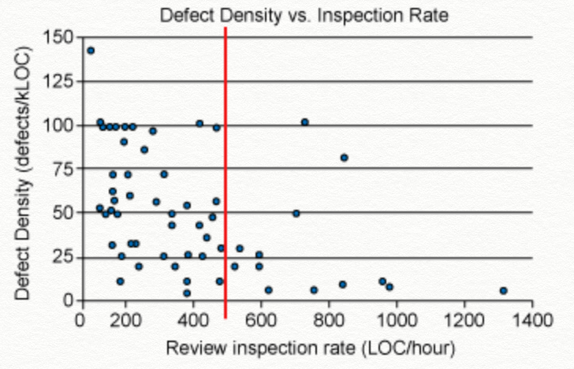

Defect density vs inspection rate, from <a href="https://smartbear.com/learn/code-review/best-practices-for-peer-code-review/">Cisco study case</a>

### 
신속한 검토 PR 보내기

의미있는 코드 검토를 받으려면 세부 사항을 구현하기 전에 토론을 시작하고 변경을 크게 보내지 마십시오. 큰 문제를 작게 나누고 작은 문제를 한 번에 하나씩 해결함으로써 나누어진 아이디어들을 다른 PR로 구분하고 필요하다면 다른 검토자를 지정하십시오.

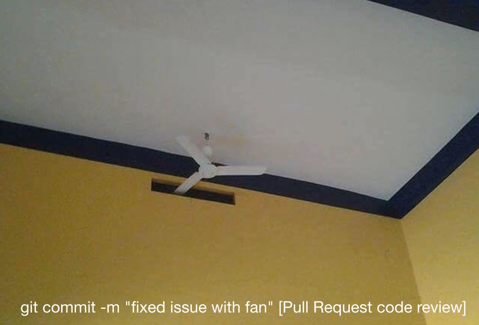

How workaround gets applied, if architectural/design problems found in the last minute PR during code review, from <a href:"https://twitter.com/isoiphone/status/824771226585296896">@isoiphone on Twitter</a>

### 
의미있는 PR을 위한 충분한 컨텍스트 제공

##### *검토자는 리소스를 매우 저게 사용하여야 하며, 대처에 지혜로워야 합니다*

검토자가 상황을 신속하게 파악할 수 있도록 변경 사항이 발생한 이유, 변경 내용 및 가능한 위험이나 우려 사항과 같은 충분한 정보를 제공하는 것이 중요합니다. 이러한 정보는 나중에 생산적인 토론을 유도하는 좋은 촉매제가 될 수 있습니다. 나아가서는 작성자는 검토 전에 추가 오류를 종종 발견할 수도 있습니다. 모든 PR에서 그와 같은 세부 사항을 작성할 필요는 없지만, 완료 및 테스트된 내용이나 검토자가 더 많은 주의를 기울여야 하는 부분에 대해 간단하게 주석을 작성하는 것이 바람직 합니다.

[Github의 이슈와 PR 템플릿](https://blog.github.com/2016-02-17-issue-and-pull-request-templates/)에서 도움을 받을 수 있습니다. 또한 개발자 자신이 무엇을 하였는지 설명하는 스크린 샷을 첨부하는 것도 좋습니다. 다음은 PR 템플릿을 사용하여 코드 검토 및 추가 QA 검증에 의미있는 컨텍스트를 제공하는 두 가지 예입니다.

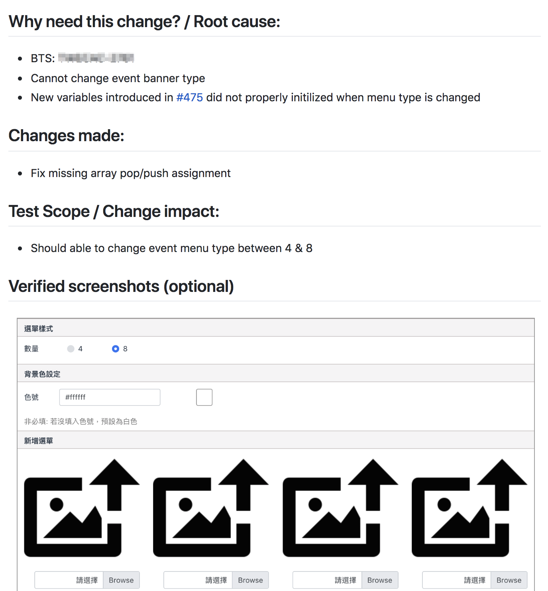

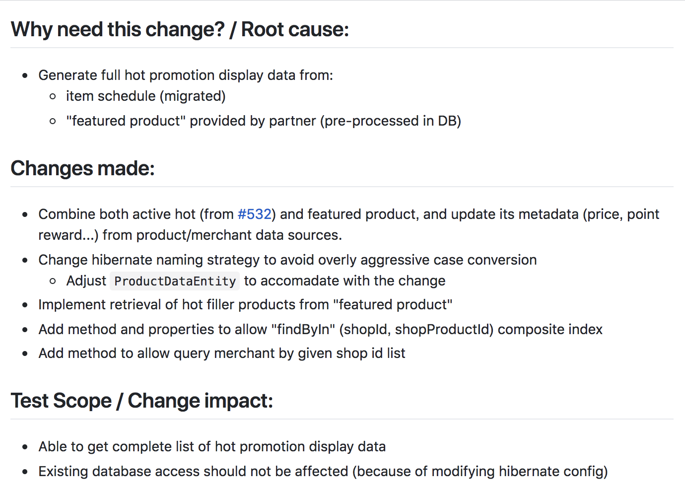

Examples of Github PR template

### 
linting 및 코드 스타일 검사

SonarQube와 ESLint 같은 도구를 사용하여 정적 코드 분석 및 코딩 스타일 검사를 수행하고 업무 로직 및 알고리즘과 같은 중요한 부분에 대한 집중하십시오. 이러한 코드 스캐닝, 유형 검사 및 linting 기능을 갖춘 신뢰성 있는 적절한 테스트 도구를 사용함으로써 버그, [코드 스멜](https://en.wikipedia.org/wiki/Code_smell) 및 취약성을 얻을 수 있습니다.

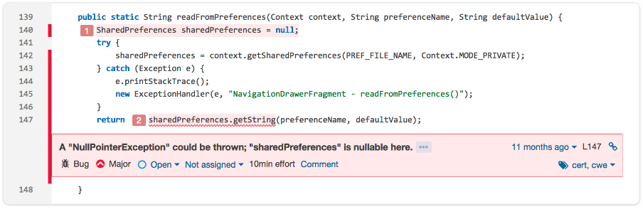

Detected issues in SonarQube from SonarQube website

개발자들에게 가능한 칭찬을 많이 하여 그들의 성장과 노력을 보상하는 것이 코드 리뷰의 가장 중요한 부분 중 하나입니다.

마지막으로, 코드의 일부를 이해할 수 없는 경우 적절한 검토를 수행할 수 없습니다. 토론이 집중되지 않고 길게 진행되면 원점으로 돌아와 토론을 마무리하고 나중에 다시 하는 것이 더 효율적일 수 있습니다.

개발자 문화의 일부로
--------------------

"문화는 사람들이 보지 않아도 실행하는 것"이라고 합니다. 코드 검토 프로세스를 건너 뛰어도 코드에 대한 적절한 테스트를 작성합니까? 쉽지 않지요? 그러나 여전히 시도해 볼만합니다. 프로젝트에서 애자일 (Agile)을 적용한다면 아래 요소를 고려하여 팀 문화를 자기 주도적이며 지속적으로 개선하고 학습하도록 하여야 합니다.

-	**자율 (Autonomy)**: 팀원은 책임감을 갖고 자신이 선호하는 방식으로 일합니다 (예 : 스크럼, 페어 프로그래밍
-	**정통 (Mastery)**: 코드 검토를 통해 지속적으로 코딩 숙력도를 높여 서로 배움으로써 각 개인은 자신의 코딩 기술을 향상시킬 수 있습니다.
-	**목적 (Purpose)**: 코드 품질이 우리의 궁극적인 목표이며, 서비스 개시 후 불을 끄는 대신 초기 단계에서 버그를 발견하고자 하는 것입니다.

아래 두 가지 항목을 실천함으로써 팀 문화를 구축하여야 합니다.

-	[기술 향상](#enhance_skill)
-	[진척 측정](#measure_progress)

### 
기술 향상

일상 업무에서 팀 전체 숙련도를 높이기 위하여는 올바른 개념과 지식이 팀원들에게 필요하므로 이를 위하여 단위 테스트, 리팩토링 및 TDD (Test-Driven Development: 테스트 주도 개발)에 대한 워크샵을 하여야 합니다.

꼭 아래와 같은 동일한 주제를 다를 필요는 없지만 예로서 아래 주제로 워크샵을 할 수 있습니다.

1.	단위 테스트
	-	테스트 구현보다는 코드 구현을 의도를 나타낼 수 있는 디자인
	-	코드 종속성의 식별과 격리
	-	추출과 덮어 쓰기 및 종속성 주입 방법 소개
	-	스텁(Stub)과 모의 프레임워크 및 어설션(assertion) 라이브러리 설명
	-	메소드 추출, 인라인 변수 등과 같은 많은 리팩토링 기술 연습
2.	패턴(Kata) (프로그래밍)
	-	요구사항 분석, 시나리오 정제 및 핵심 예 추출
	-	코드 설계 및 구현
3.	TDD 및 리팩토링(refactoring)
	-	데모 리팩토링, 코드 스멜과 이들을 없애는 연관된 메소드
	-	TDD 방식의 라이브 코딩 (live coding) (예: 베이비 스템 (baby step), 빨간불 파란불 (red light green light 등)
	-	연습

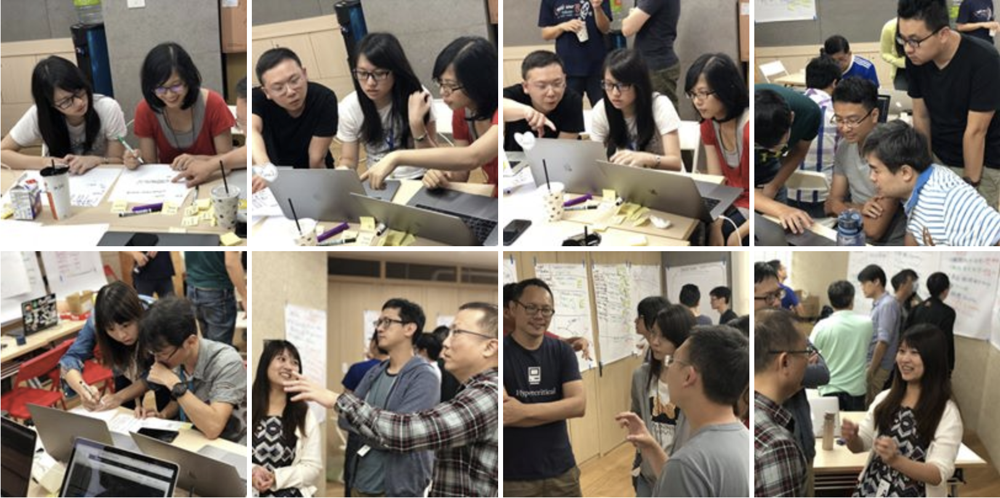 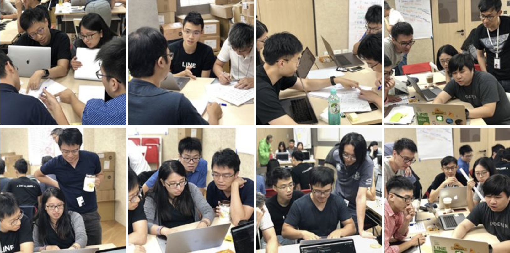

Snapshots during workshop

### 
진척 측정

진척 상황을 볼 수 없다면, 이를 측정 할 수 없으며 이를 개선시킬 수도 없습니다.

대시보드와 시각적 효과를 활용하여 팀원들에게 목표를 지속적으로 상기시키는 알림 메시지를 보내고, 로그인 후 첫 화면에 크게 아래와 같은 대시보드를 보이도록 합니다.

-	[SonarCube 프로젝트 대시보드](#sonarcube_dashboard)
-	[팀별 코드 커버리지](#code_coverage)
-	[PR 크기 및 해결 시간](#PR_size)
-	[PR 주석 알림](#PR_comment)

#### 
SonarCube 프로젝트 대시보드

SonarQube는 정적 코드 분석의 통계를 생성하며, 코드 저장소는 배포 서비스에 직접 연결되어 보고서를 작성합니다.

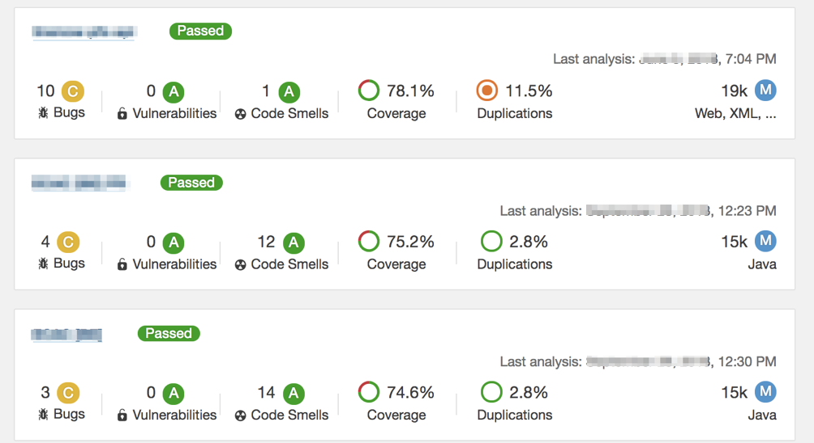

#### 
팀별 코드 커버리지

팀별 코드 커버리지 차트는 각 SonarQube 프로젝트 페이지로 따로 이동할 필요없이 팀의 각 리포지토리 커버리지 추세를 보여주므로 다른 팀의 활동과 쉽게 비교할 수 있습니다.

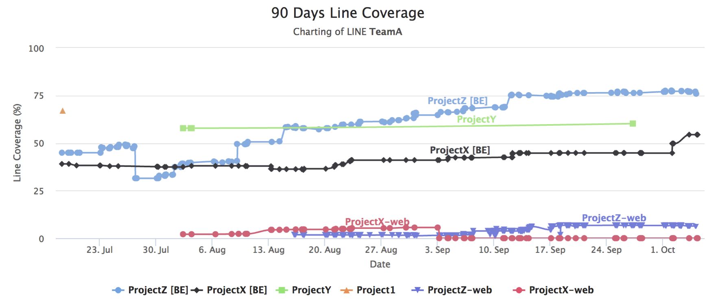

#### 
PR 크기 및 해결 시간

소프트웨어 변경 사항을 잦은 배포 뿐만아니라 양질으로 릴리스하는 것이 DevOps의 핵심입니다. 각 배포 단위를 작게 만드는 것은 어렵지 않습니다. 대규모 PR은 코드 검토를 어렵게 할 뿐만 아니라 코드 품질과 출시 주기 비용도 증가시키므로 작업 또는 변경을 작게 만드는 것은 DevOps에서 핵심적인 기술입니다. 아래의 "Resolution time vs. PR size"차트로 이를 보이려고 합니다.

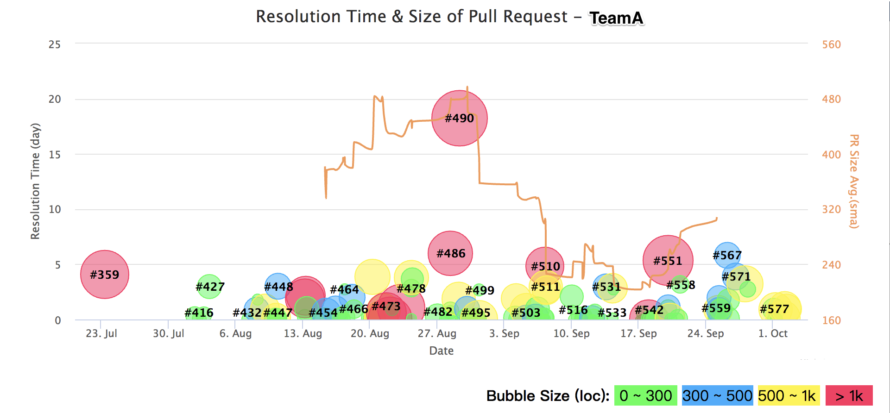

-	버블 크기 : 변경 크기 (LoC)
-	해결 시간 : PR 시작에서 PR 병합까지 시간
-	#n : PR 번호

위 차트는 추구하는 바람직한 관행과 목표를 채택하는 과정을 지속적으로 일깨워 줍니다. 이것은 몇 가지 예일 뿐이며 팀원들에게 의도를 시각적으로 보여줄 수 있도록 하십시요. 뿐만아니라 회의에서 진도를 요약하여 보여줄 수 있어 유용합니다.

#### 
PR 주석 알림

PR에 제출된 각 커밋은 webhook을 트리거하여 github 주석을 게시합니다. 이는 변경 사항을 반영하여 프로덕션으로 릴리스된 2 주 후에 변경하는 것보다 효율적이므로 PR 제출자에게 테스트를 추가하고 PR 내부에서 발견된 새로운 취약점을 수정하도록 상기시킬 수 있습니다. 검토자는 문제가 발생한 이유를 찾을 수 있도록 개발자를 도와줌으로써 품질 지표를 향상시킬 수 있습니다.

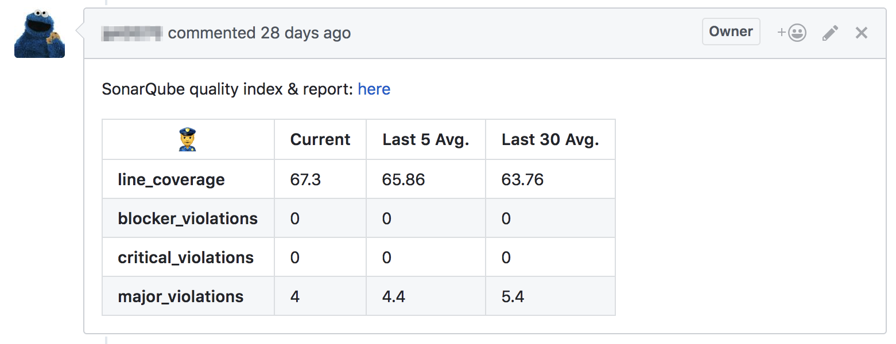

-	지난 n 개의 평균 : 각 측정 항목의 추세를 보여 줍니다.
-	xxx_violations : 발견 된 버그, 취약성 및 코드 스멜의 수
-	line_coverage : 단위 테스트에서 수행된 LoC의 백분율

요약
----

클린 코드(clean code)를 작성하는 방법과 코드 스멜을 찾아내고 제거하는 방법은 코드 검토 토론을 위한 바람직한 환경이며, 팀에서 이러한 공통 문제를 해결하고자 시간을 투자할 때 문화가 만들어 지는 것입니다.

추적하지 않는 측정 항목은 유용하지 않습니다. 시간 경과에 따른 데이터 추세를 보여주는 것은 매우 중요하며, 이는 우리가 취할 수 있는 대응 방법을 제공합니다. 위의 차트에서 보면 상황의 진행과 함께 움직이는 추세를 볼 수 있습니다. 또한 아래와 같은 대시보드 추가를 고려할 수도 있습니다.

-	품질 : 심각도, 결함 밀도에 따른 발견된 버그 수과 해결된 수
-	속도 : 배포 빈도, 배포까지의 소요 타임, 변경 실패율 및 MTTR

참고 문헌
---------

-	[Gerrit] [Code Review – Contributing](https://gerritcodereview-test.gsrc.io/dev-contributing.html#code-organization)
-	[Phabricator] [Writing Reviewable Code](https://secure.phabricator.com/book/phabflavor/article/writing_reviewable_code/)
-	[Phabricator] [Differential User Guide: Test Plans](https://secure.phabricator.com/book/phabricator/article/differential_test_plans/)
-	[MSFT] [Code Reviews and SW quality, Empirical Research Results](https://www.linkedin.com/pulse/code-reviews-software-quality-empirical-research-results-avteniev/)
-	[Cisco] [Best Practice for Code Review](https://smartbear.com/learn/code-review/best-practices-for-peer-code-review/)
-	[Book] [Accelerate: The Science of Lean Software and DevOps](https://www.amazon.com/Accelerate-Software-Performing-Technology-Organizations-ebook/dp/B07B9F83WM)
-	[Drive] [The Surprising Truth About Motivating Others](https://www.danpink.com/books/drive)
